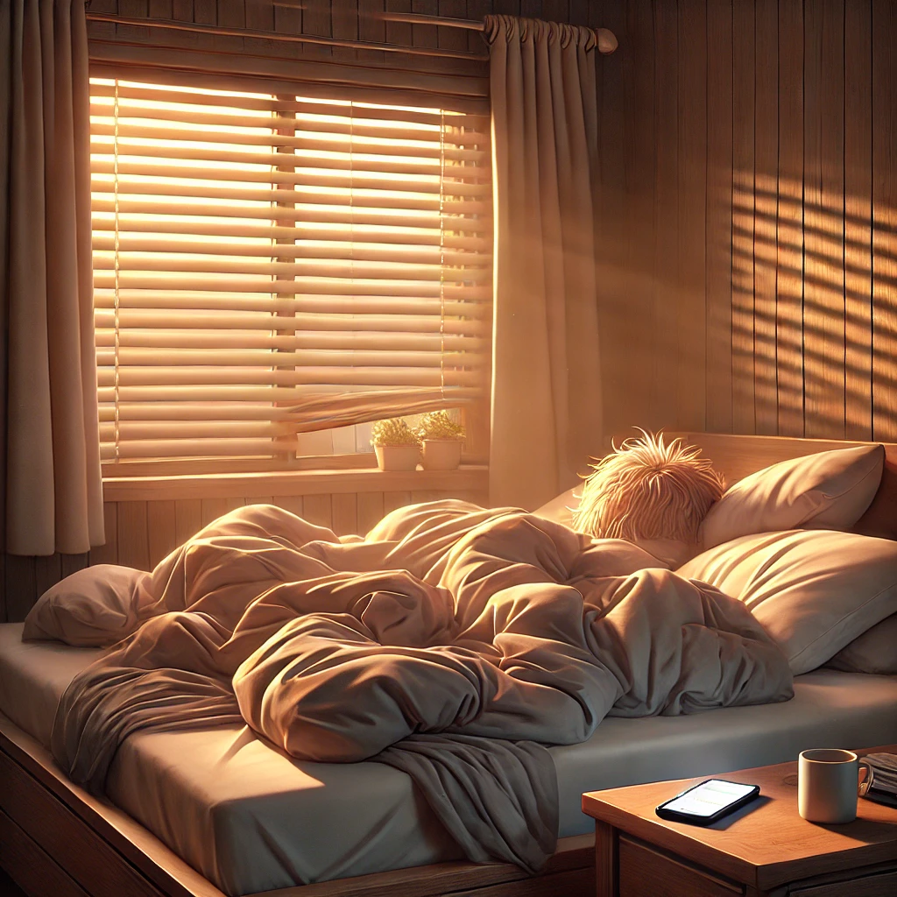
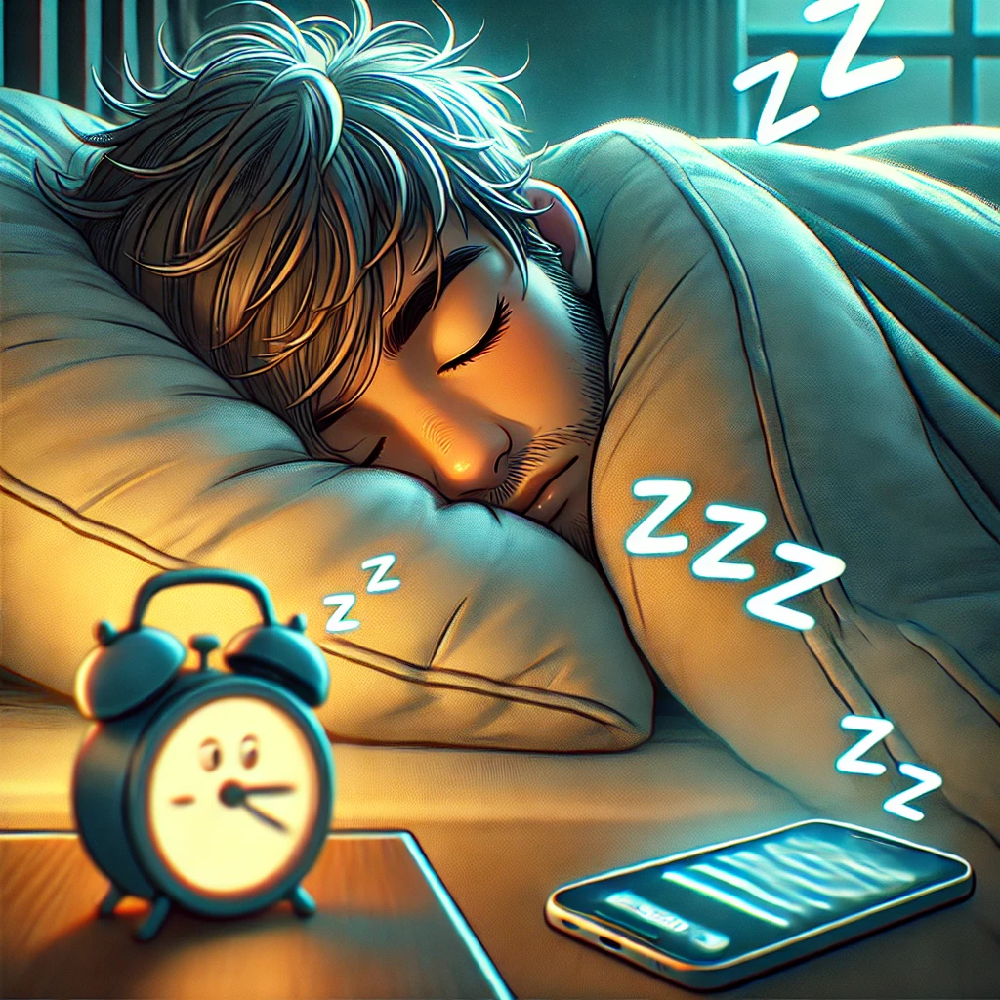
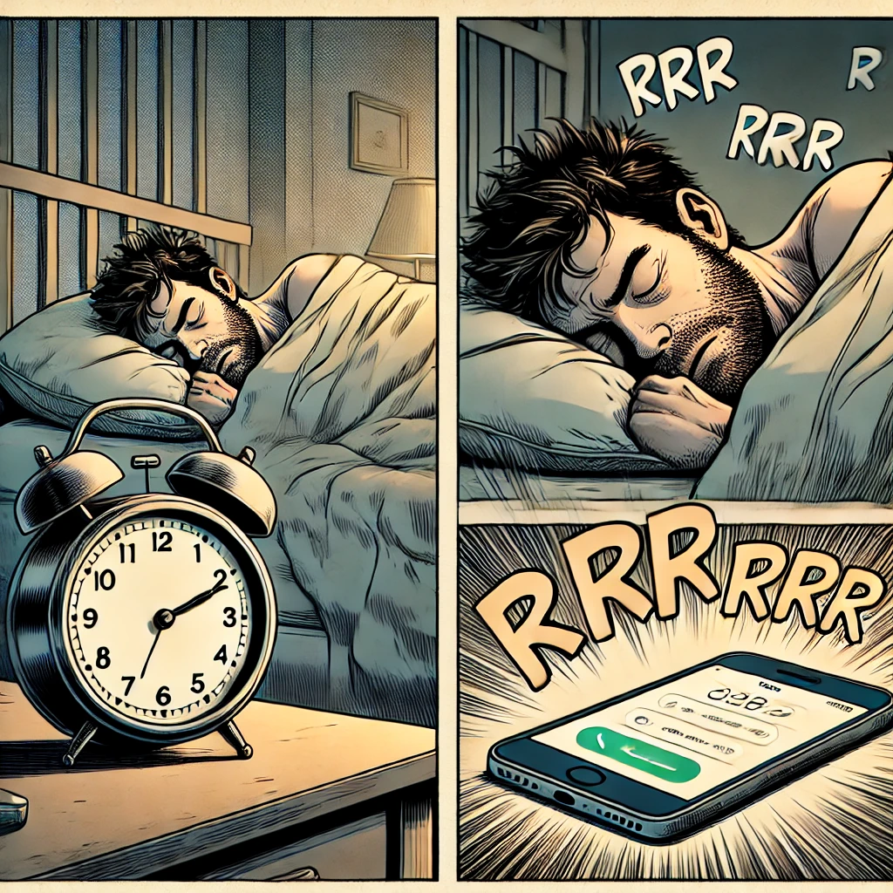

# Aufgabe

Erstelle eine Seite für meinen Comic über das Leben von Tom mit ChatGPT.

- Storyline: Die Geschichte in einem Satz. (Von Dir)
- Storyboard: Wie sieht die Geschichte aus? (Zusammen mit ChatGPT)
- Bildbeschreibung & Panels (Bilder): Was ist auf den einzelnen Bildern zu sehen? (Erstes Bild detailiert von ChatGPT beschrieben)
- Dialoge: Was sagen die Figuren? (Von Dir)
- Zusammenfügen: In einem Graphikprogram, füge die Bilder und Dialoge zusammen.

# Lösung

## Storyboard

- **Prompt**: \blue{Ich möchte für meinen Comic eine Seite über einen Tag in Toms Leben erstellen.}

\blue{Auf den ersten Seiten geht es darum, dass Tom schläft, den Alarm (visuell und akustisch) seines Handys ignoriert und schließlich durch einen alten analogen Wecker geweckt wird.}
\blue{Bitte schreibe ein kurzes Storyboard mit:}
\blue{* Die Beschreibung von Seite 1}
\blue{* Die Bilder von Seite 1: Titel, detaillierte Beschreibung für das Grafikteam }

**Storyboard for One Day of Tom’s Life - Page 1 - "Rise and Shine, Tom!"**

Tom's Morgen beginnt auf chaotische, aber komische Weise. Die Seite etabliert seine Persönlichkeit als jemanden, der Schwierigkeiten hat, aufzuwachen, und macht sich über seine Abhängigkeit von modernen und altmodischen Methoden lustig, um aus dem Bett zu kommen. Die Seite verwendet Humor und Übertreibung, um die Leser zum Lachen zu bringen und den Ton für den Comic zu setzen.

**Grafiken und Panel-Beschreibungen:**

- **Panel 1: Titel-Panel**

    **Visuelle Beschreibung:**
        Ein gemütliches Schlafzimmer bei Tagesanbruch. Der Raum ist schwach beleuchtet mit sanften, warmen Farben, während die frühe Morgensonne durch die Fensterjalousien späht.
        Tom ist im Bett sichtbar, unter einem Berg von Decken vergraben, mit nur seinem unordentlichen Haar, das herausragt.
        Ein Telefon liegt auf dem Nachttisch, dessen Bildschirm schwach leuchtet.
    **Text:**
        **Titel:** Ein Tag im Leben von Tom
        **Untertitel:** Kapitel 1: Aufstehen und Strahlen, Tom!

- **Panel 2: Tom schläft friedlich**

    **Visuelle Beschreibung:**
        Nahaufnahme von Toms Gesicht, geschlossene Augen, leicht geöffneter Mund, leises Schnarchen. Sein Haar ist wild, und seine Wange ist gegen ein Kissen gedrückt.
        Das Telefon auf dem Tisch zeigt eine cartoonhafte "Zzz"-Sprechblase, die vom Bildschirm kommt, neben einem animierten vibrierenden Alarmton.
    **Text (SFX):**
        "BRRRRING! BRRRRING!"
        "Zzzzz..."

- **Panel 3: Alarm ignoriert**

    **Visuelle Beschreibung:**
        Eine weitere Aufnahme des Raumes. Der Telefonalarm blinkt jetzt rot auf dem Bildschirm, während er heftig auf dem Nachttisch vibriert und kurz davor ist, herunterzufallen.
        Tom bleibt unter der Decke unbeeindruckt, mit einem Fuß, der aus der Decke herausragt.
    **Text (SFX):**
        "BZZZZ! BZZZZ!"
        "BUMM!" (während das Telefon auf den Boden fällt)

- **Panel 4: Analoger Wecker betritt die Szene**

    **Visuelle Beschreibung:**
        Eine vintage, cartoonhaft große analoge Wecker auf einem nahegelegenen Regal springt in Aktion. Seine Glocken läuten mit übertriebener Energie, und es wurden lustige Glubschaugen hinzugefügt, um es humorvoll zu machen.
        Die winzigen "Arme" des Weckers winken hektisch und zeigen auf die Uhrzeit: 7:30 Uhr.
    **Text (SFX):**
        "KLANG! KLANG! KLANG!"

- **Panel 5: Tom reagiert**

    **Visuelle Beschreibung:**
        Tom setzt sich endlich im Bett auf, das Haar zerzaust, halb geschlossene Augen und sichtbar grummelig. Eine Hand schlägt auf den analogen Wecker, um ihn auszuschalten, während die andere Hand seine Augen reibt.
        Das Telefon liegt auf dem Boden, blinkt immer noch schwach, wird aber ignoriert.
    **Text (Dialog/SFX):**
        **Tom:** "Ugh, in Ordnung! Ich stehe auf, ich stehe auf..."
        **Wecker (Gedankenblase):** "Endlich!"

## Panels

- **Prompt**: \blue{Bitte zeichnen Sie Panel 1 des Storyboards des Comics.}

\red{lade das generierte Bild wieder hoch}

- **Prompt**: \blue{Please describe the uploaded image in detail so I have a prompt of the style for the next generation.}
- **Prompt**: \blue{Bitte beschreiben Sie das hochgeladene Bild im Detail, damit ich einen Hinweis auf den Stil für die nächste Generation habe.}
- **Prompt**: \blue{Bitte zeichnen Sie Panel 2 des Storyboards des Comics im obigen Stil}

\red{von hier an machen wir unsere eigene Beschreibung}

Here is the German translation of your text:

---

- **Prompt**: \blue{Dieses Bild für einen Comic in einem sparsamen Stil stellt eine Nahaufnahme-Szene eines friedlichen und gemütlichen Schlafzimmermoments dar. Hier ist eine detaillierte Transkription:

    **Schlafende Person:**  
        Ein Mann wird schlafend im Bett gezeigt, mit unordentlichen Haaren und einem leicht stoppeligem Gesicht, was eine entspannte, natürliche Umgebung andeutet.  
        Seine Wange ist gegen ein weiches Kissen gedrückt, seine Augen sind geschlossen, was ihm einen ruhigen und erholsamen Ausdruck verleiht.  

    **Decken und Bett:**  
        Er ist unter weichen, flauschigen Decken eingekuschelt, was das Gefühl von Komfort und Wärme verstärkt.  
        Der Bettrahmen ist nur schwach sichtbar, da der Fokus auf der Person und den Objekten um sie herum liegt.  

    **Wecker:**  
        Ein analoger Wecker im Vintage-Stil ist im Vordergrund auf einem Nachttisch deutlich platziert.  
        In dieser Szene bleibt er inaktiv, ohne Anzeichen eines klingelnden Alarms.  

    **Smartphone:**  
        Ein Smartphone ruht auf demselben Nachttisch, sein Bildschirm leuchtet schwach, als würde es Benachrichtigungen empfangen oder einen Alarm auslösen.  
        Das Smartphone vibriert heftig, hüpft leicht und macht ein lautes „RRR“-Geräusch.  
        Der Rest der Szene bleibt ruhig, was die Idee verstärkt, dass der Schläfer das Telefon ignoriert und weiterhin schläft.  

    **Beleuchtung:**  
        Die Beleuchtung ist gedimmt, passend zur Morgendämmerung, mit einem sanften, warmen Licht, das das Bett und die schlafende Figur beleuchtet.  
        Die Szene strahlt eine ruhige und gemütliche Atmosphäre aus.  

    **Dekorative Elemente:**  
        Der Hintergrund ist verschwommen, deutet aber ein typisches Schlafzimmer mit einfachen Details und einer gemütlichen Atmosphäre an.  

Nutze die obige Beschreibung, um **Panel 2** neu zu zeichnen, mit einer stärkeren Betonung der Alarmwirkung des Smartphones. Der analoge Wecker bleibt ruhig.}  

## Design the dialogs

Basierend auf Ihrem Storyboard und den visuellen Elementen, erstellen Sie Dialoge für den Comicstrip.

## Putting it all together

Verwende ein Grafikdesign-Tool, um die Bilder und Dialoge zu einem Comicstrip zu kombinieren. Stellen Sie sicher, dass die visuellen Elemente und der Text gut ausgerichtet und visuell ansprechend sind. Der Comic sollte reibungslos von Panel zu Panel fließen und den Humor und die Essenz der Geschichte einfangen.

