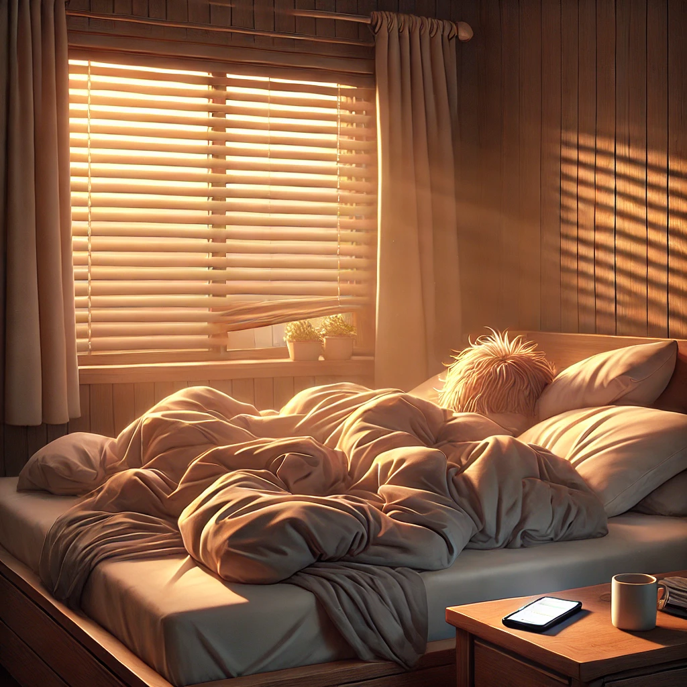
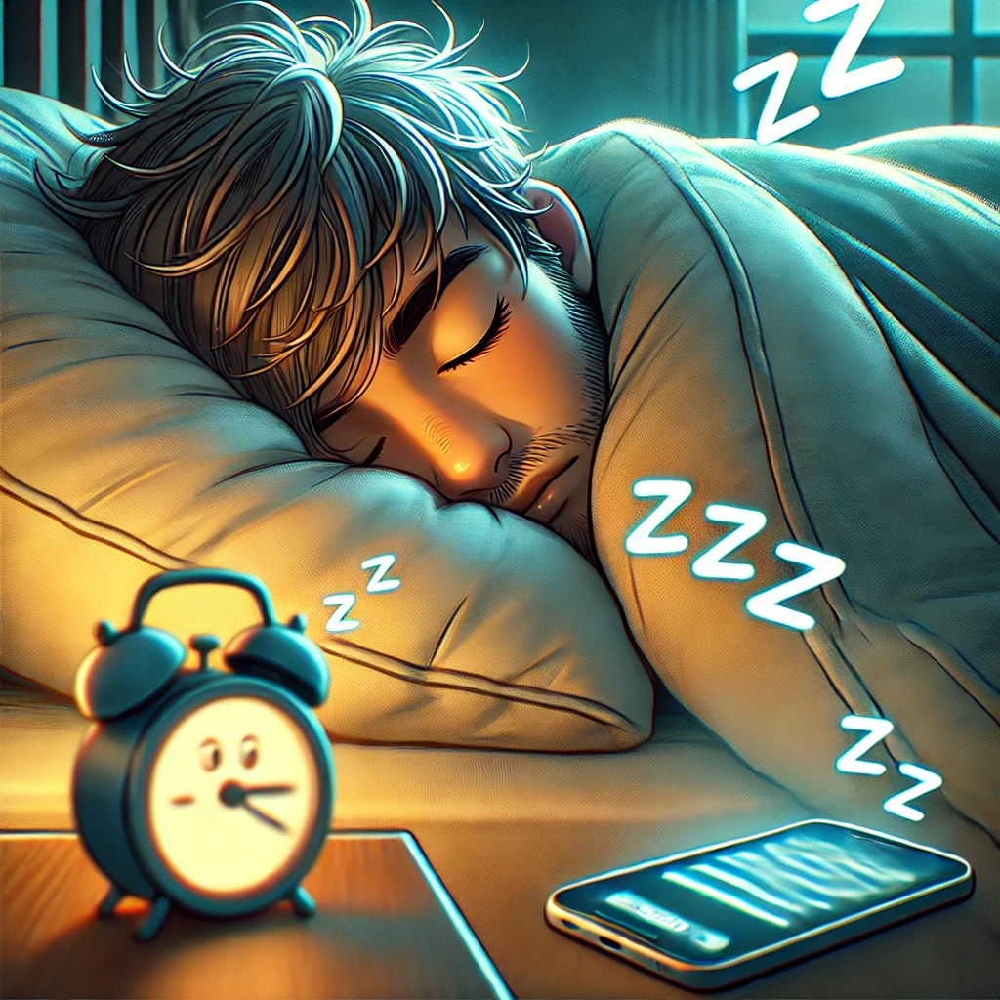

# Aufgabe

Erstelle eine Seite für meinen Comic über das Leben von Tom mit ChatGPT.

- Storyline: Die Geschichte in einem Satz. (Von Dir)
- Storyboard: Wie sieht die Geschichte aus? (Zusammen mit ChatGPT)
- Bildbeschreibung & Panels (Bilder): Was ist auf den einzelnen Bildern zu sehen? (Erstes Bild detailiert von ChatGPT beschrieben)
- Dialoge: Was sagen die Figuren? (Von Dir)
- Zusammenfügen: In einem Graphikprogram, füge die Bilder und Dialoge zusammen.

# Lösung

## Storyboard

- **Prompt**: \blue{
I would like to create a page for my Comic one day of Toms life.

The first pages focus on Tom sleeping, ignoring the alarm (visual and sound) from his mobil, and finally getting up due to an old anolog alarm clock.

Please write a short story board with:

The description of page1
The pictures of page1: Title, detailed description for the graphics team}

### Storyboard for One Day of Tom’s Life - Page 1 - "Rise and Shine, Tom!"

Tom's morning begins in a chaotic yet comical manner. The page establishes his personality as someone who struggles to wake up and pokes fun at his reliance on modern and old-fashioned methods to get out of bed. The page uses humor and exaggeration to make readers laugh and set the tone for the comic.
Graphics and Panel Descriptions:

- **Panel 1: Title Panel**

    Visual Description:
        A cozy bedroom at dawn. The room is dimly lit with soft, warm colors as the early morning sun peeks through the window blinds.
        Tom is visible in bed, buried under a mountain of blankets with only his messy hair sticking out.
        A phone lies on the bedside table, its screen glowing faintly.
    Text:
        Title: One Day of Tom’s Life
        Subtitle: Chapter 1: Rise and Shine, Tom!

- **Panel 2: Tom Sleeping Peacefully**

    Visual Description:
        Close-up of Tom's face, eyes closed, mouth slightly open, snoring softly. His hair is wild, and his cheek is squished against a pillow.
        The phone on the table shows a cartoonish "Zzz" speech bubble coming from the screen, alongside an animated vibrating alarm sound.
    Text (SFX):
        "BRRRRING! BRRRRING!"
        "Zzzzz..."

- **Panel 3: Alarm Ignored**

    Visual Description:
        A wider shot of the room. The phone alarm is now flashing red on the screen while vibrating violently on the bedside table, about to fall off.
        Tom remains unfazed under the covers, with one foot sticking out of the blanket.
    Text (SFX):
        "BZZZZ! BZZZZ!"
        "THUMP!" (as the phone falls to the floor)

- **Panel 4: Analog Alarm Enters the Scene**

    Visual Description:
        A vintage, cartoonishly large analog alarm clock on a nearby shelf springs into action. Its bells clang with exaggerated energy, and it has googly eyes added to make it humorous.
        The clock’s tiny "arms" wave frantically, pointing at the time: 7:30 AM.
    Text (SFX):
        "CLANG! CLANG! CLANG!"

- **Panel 5: Tom Reacts**

    Visual Description:
        Tom finally sits up in bed, hair in disarray, eyes half-closed, and visibly grumpy. One hand smacks the analog alarm clock to silence it, while the other rubs his eyes.
        The phone lies on the floor, still flashing faintly but ignored.
    Text (Dialogue/SFX):
        Tom: "Ugh, alright! I’m up, I’m up..."
        Alarm Clock (thought bubble): "Finally!"

## Panels

- **Prompt**: \blue{Please draw Panel 1 of the story board of the comic.}

\red{upload the image and ask for a detailed description}

- **Prompt**: \blue{Please describe the uploaded image in detail so I have a prompt of the style for the next generation.}

- **Prompt**: \blue{Please draw Panel 2 of the story board of the comic in above style}

\red{now we do our own description}

- **Prompt**: \blue{This image for a comic in a sparse style portrays a close-up scene of a peaceful and cozy bedroom moment. Here's a detailed transcription:

    Person Sleeping:
        A man is shown sleeping on a bed, with messy hair and a slightly scruffy face, hinting at a relaxed, natural setting.
        His cheek is squished against a soft pillow, with his eyes closed, giving a serene and restful expression.

    Blankets and Bed:
        He is tucked under soft, fluffy blankets, adding to the sense of comfort and warmth.
        The bed frame is only faintly visible, as the focus is on the person and objects around him.

    Alarm Clock:
        A vintage-style analog alarm clock is prominently placed in the foreground on a bedside table.
        It appears to be inanimate in this scene, with no signs of ringing.

    Smartphone:
        A smartphone rests on the same bedside table, its screen faintly glowing as if receiving notifications or emitting an alarm.
       The smartphone is buzzing, hoping, make RRR noise.
        There rest of the scene stay calm, reinforcing the idea of the sleeper ignoring the phone, continuous to sleep.

    Lighting:
        The lighting is dim, consistent with dawn, with a soft, warm glow illuminating the bed and the sleeping figure.
        The scene has a calm and cozy atmosphere.

    Decorative Elements:
        The background is blurred but suggests a typical bedroom with simple details and a cozy ambiance.

Use above for redrawing panel2 with more prominent alarm action of the smart phone. The analog alarm clock stays calm}

## Design the dialogs

Based on your storyboard and visuals, create dialogues for the comic strip. 

## Putting it all together

Use a graphic design tool to combine the images and dialogues into a comic strip. Ensure that the visuals and text are well-aligned and visually appealing. The comic should flow smoothly from panel to panel, capturing the humor and essence of the story.

