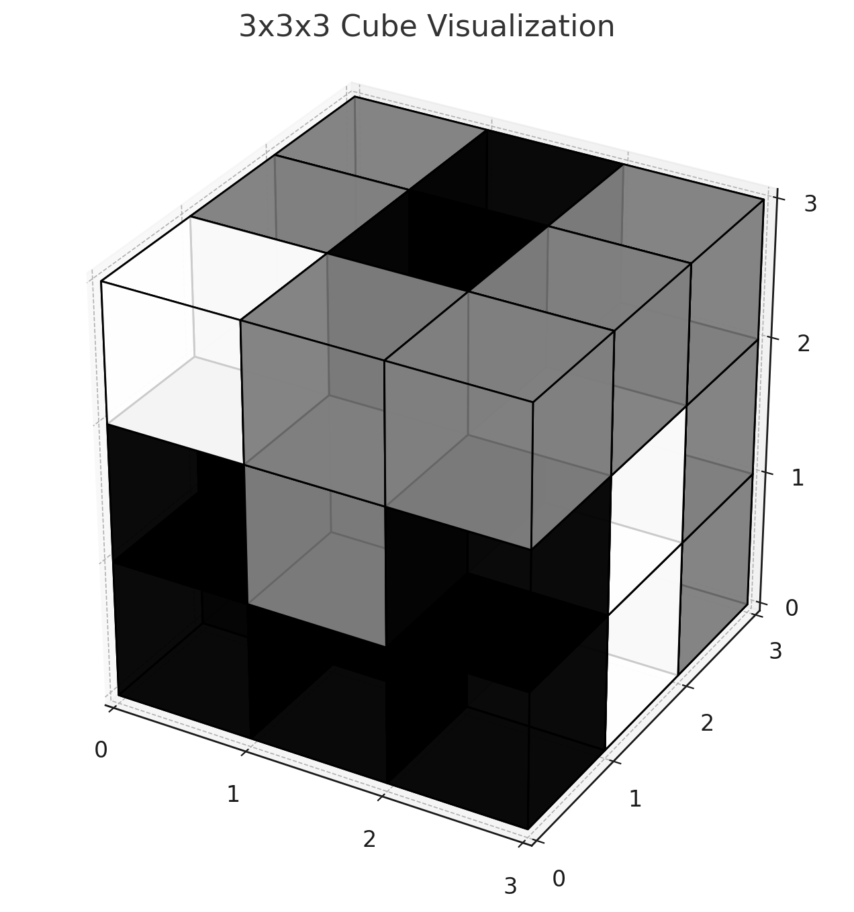
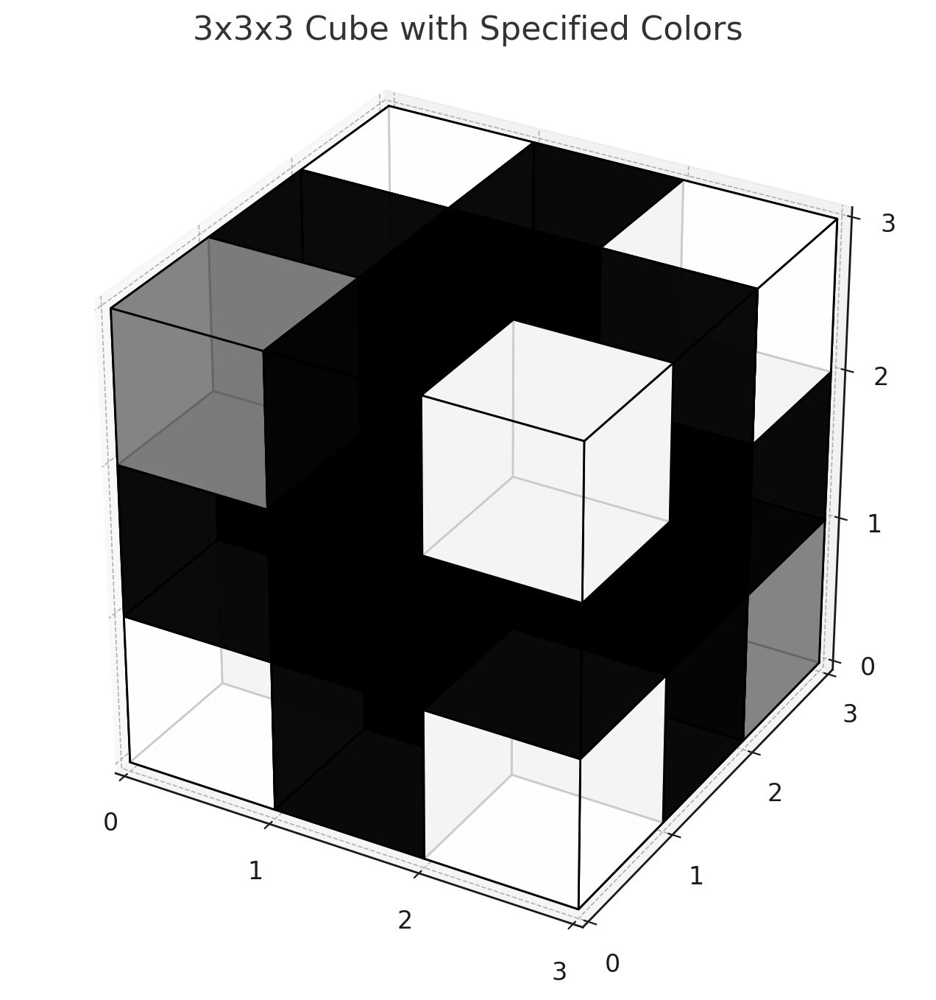
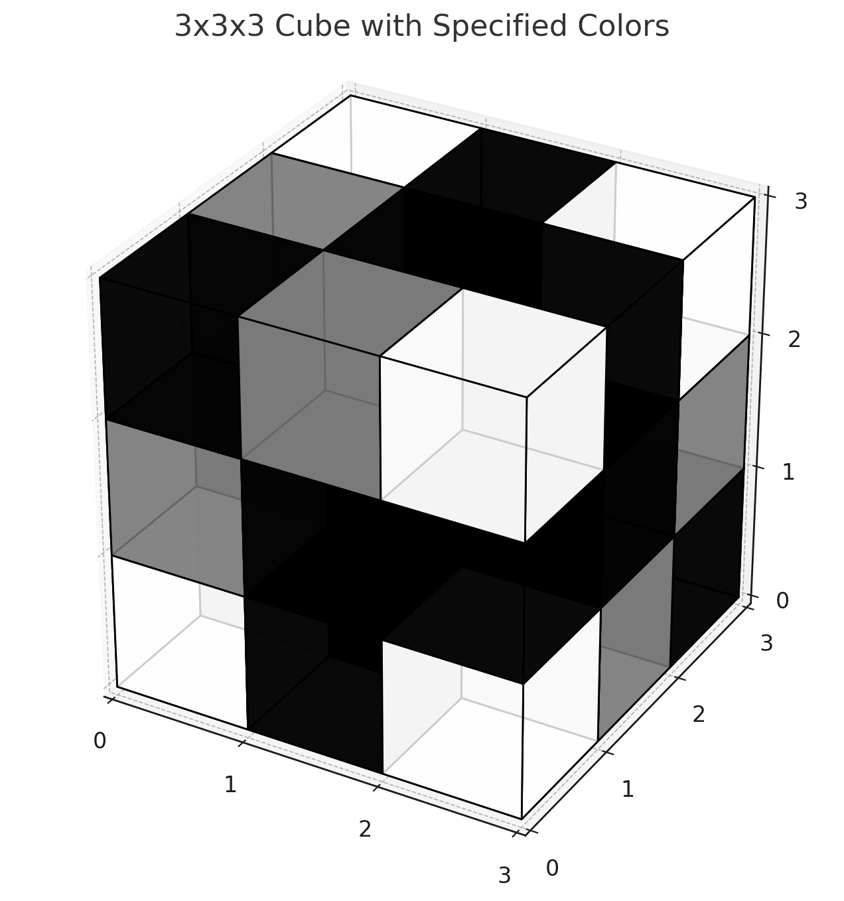
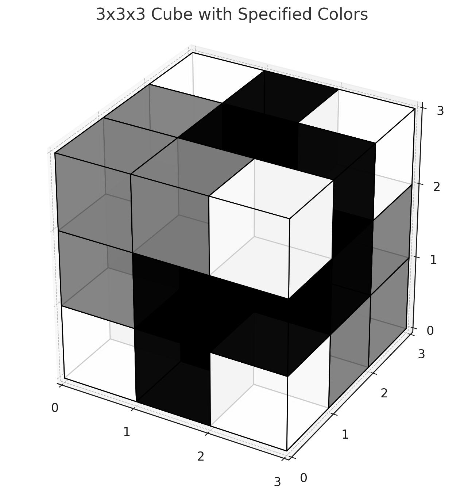
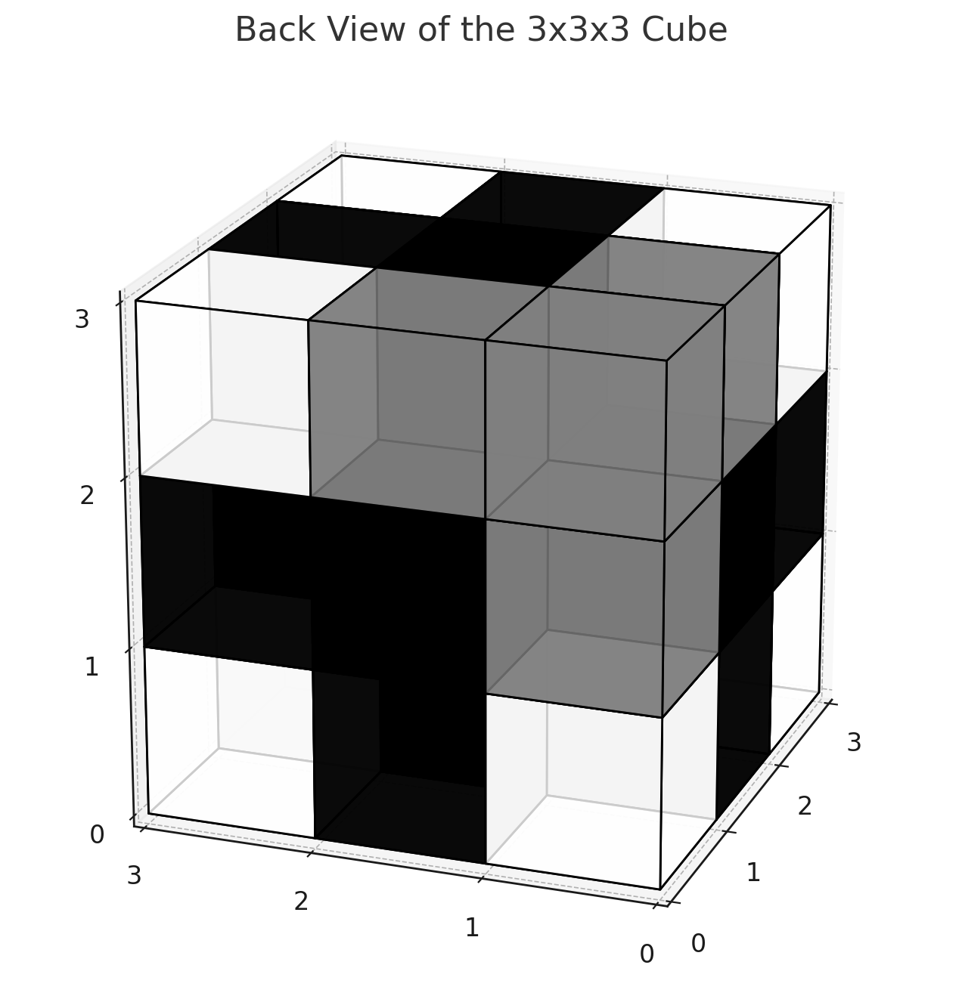

# Aufgabe

Leo hat aus 27 kleinen, gleich grossen Würfeln einen grossen 3× 3× 3-Würfel gebaut. Die kleinen Würfel sind schwarz, grau oder weiss. Die Oberfläche des grossen Würfels ist jeweils zu einem Drittel schwarz, grau und weiss. Leo hat die grösstmögliche Anzahl an schwarzen Würfeln und die kleinstmögliche Anzahl an weißen Würfeln verwendet. Wie viele graue Würfel hat Leo verwendet?

# Lösung

## Direkte Frage

- **Prompt**: \blue{Kannst du mir bei folgendem mathematischen Problem behilflich sein: "Leo hat aus 27 kleinen, gleich grossen Würfeln einen grossen 3× 3× 3-Würfel gebaut. Die kleinen Würfel sind schwarz, grau oder weiss. Die Oberfläche des grossen Würfels ist jeweils zu einem Drittel schwarz, grau und weiss. Leo hat die grösstmögliche Anzahl an schwarzen Würfeln und die kleinstmögliche Anzahl an weißen Würfeln verwendet. Wie viele graue Würfel hat Leo verwendet?" Zeichne mir doch zuerst einmal mit Python mathplotlib ein Bild eines 3x3x3 Würfels.}

ChatGPT hilft schon einmal bei der Visualisierung des Problems.

Der Würfel erscheint in einem Koordinatensystem.

#### 1. **Visualisierung**
Hier ist eine Visualisierung eines 3x3x3-Würfels. Die Würfel in verschiedenen Farben repräsentieren die möglichen Farben der einzelnen kleinen Würfel. Möchtest du, dass ich diese Farben genauer an die Problemstellung anpasse, oder sollen wir mit der Lösung der Frage fortfahren?

- **Prompt**: \blue{Ich gebe dir die Koordinaten für die Eckwüfel bekannt. Die sechs weissen Würfel liegen in den Punkten (0,0,0), (2,0,0), (0,2,0), (2,0,2), (0,2,2) und (2,2,2). Die grauen Würfel liegen in den Koordinaten (2,2,0) und (0,0,2).}

Danke für die Information! Ich werde die Eckwürfel entsprechend deiner Angaben anpassen und eine aktualisierte Visualisierung des 3x3x3-Würfels erstellen. Ich werde dabei die folgenden Farbcodierungen verwenden: 

- **Weiße Würfel**: Die Würfel an den angegebenen Koordinaten (6 Würfel).
- **Graue Würfel**: Die Würfel an den angegebenen Koordinaten (2 Würfel).
- **Schwarze Würfel**: Alle anderen Würfel.

Ich aktualisiere die Visualisierung entsprechend.

Hier ist die aktualisierte Visualisierung des 3x3x3-Würfels, wobei die Farben wie folgt verteilt sind:

- **Weiße Würfel**: An den angegebenen sechs Koordinaten.
- **Graue Würfel**: An den beiden angegebenen Koordinaten.
- **Schwarze Würfel**: Alle übrigen Würfel.

Möchtest du, dass ich die Anzahl der grauen Würfel berechne oder etwas anderes hinzufüge?

- **Prompt**: \blue{Passe die obige Figur an. Die Würfel mit folgenden Koordinaten sollen grau sein: (2,1,0), (1,2,0), (1,0,2), (0,1,2), (0,0,1), (2,2,1)}

Hier ist die aktualisierte Visualisierung des 3x3x3-Würfels. Die grauen Würfel befinden sich jetzt an den von dir angegebenen neuen Koordinaten, während die weißen Würfel unverändert geblieben sind und die restlichen Würfel schwarz sind.

Benötigst du weitere Anpassungen oder Berechnungen?

- **Prompt**: \blue{Übernehme die Figur wie oben, ersetze aber zwei Würfel. Die Würfel mit folgenden Koordinaten sollen grau sein: (0,0,2) und (2,2,0).}

Hier ist die aktualisierte Visualisierung des 3x3x3-Würfels. Die grauen Würfel befinden sich nun an den endgültigen Koordinaten, einschließlich der Ersetzung durch (0,0,2) und (2,2,0). Die weißen Würfel bleiben unverändert, und die restlichen Würfel sind schwarz.

Gibt es noch weitere Änderungen oder Berechnungen, die du durchführen möchtest?

- **Prompt**: \blue{Der Würfel mit der Koordinate (1,1,1) soll schwarz sein. Zähle nun die Anzahl weisser, schwarzer und grauer Würfel.}

Die Anzahl der Würfel in den jeweiligen Farben ist wie folgt:

- **Weiße Würfel**: 6  
- **Graue Würfel**: 8  
- **Schwarze Würfel**: 13  

Möchtest du weitere Berechnungen durchführen oder Anpassungen vornehmen?

- **Prompt**: \blue{Ok, zeige mir vom obigen Würfel seine Rückseite.}

Hier ist die Rückseite des 3x3x3-Würfels, basierend auf den angegebenen Farben:

- **Weiße Würfel**: 6 Stück an den angegebenen Positionen.
- **Graue Würfel**: 8 Stück, einschließlich der aktualisierten Positionen.
- **Schwarzer Würfel**: An der zentralen Position (1,1,1) und die verbleibenden Würfel.

Benötigst du weitere Ansichten oder Analysen?

